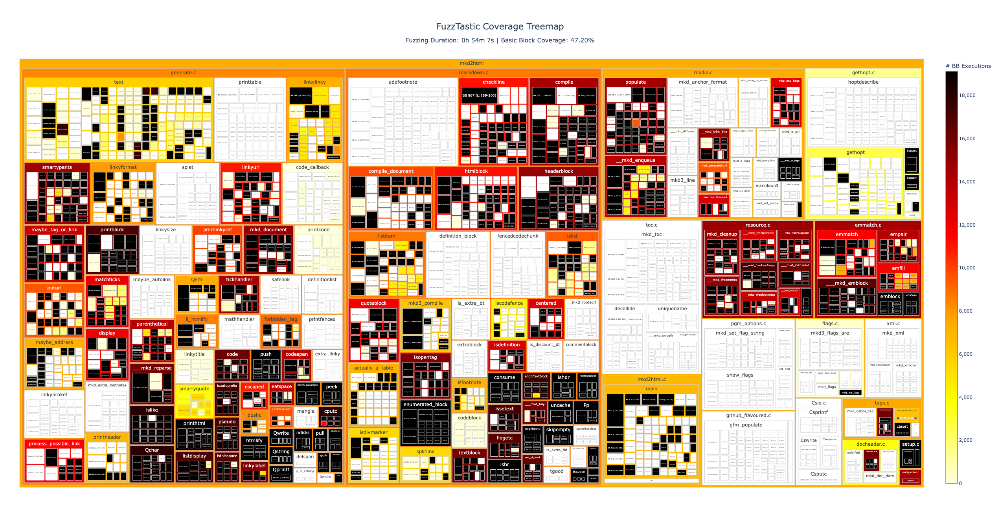

<div align="center">

# FuzzTastic

**A Fuzzer-Agnostic Real-Time Coverage Analyzer**



</div>

FuzzTastic is a code coverage analyzer primarily designed for fuzzing campaigns. It comes with the following **features**:

- Compatible with any available fuzzer.

- Monitors line, basic block, and function coverage in parallel with the campaign.

- Tracks the exact number of fuzz inputs exercising each code region.

- Dynamic tracking schedule to adjust the coverage sampling rate during the campaign.

- Interactive visualization that shows the current code coverage in a treemap.

## Contents

- :clapper: [Demo](#demo)

- :package: [Installation](#installation)

- :rocket: [Usage](#usage)

- :man_technologist: [Development](#development)

## Demo

The quickest way to try out FuzzTastic is by running its demo in the Docker container:

```bash
git clone <repo-link>
cd fuzztastic

docker-compose run fuzztastic bash ./scripts/demo.sh
```

In this demo, AFL++ fuzzes the `mkd2html` program of the [Discount project](https://github.com/Orc/discount) for **10 minutes** while FuzzTastic tracks and visualizes the code coverage. It first generates a basic block metadata file (`mkd2html.json`), followed by periodic coverage reports (`ft_cov_<epoch>.json`) at one-minute intervals (all files are stored in the `scripts/demo` directory). Moreover, it launches the treemap visualization, which can be viewed in the browser at `http://127.0.0.1:8050` (updated every 30 seconds).

## Installation

Please refer to the [`Dockerfile`](Dockerfile) for the required software dependencies.

### Setup

```bash
git clone <repo-link>
cd fuzztastic

# Install the Python dependencies
poetry install

# Build the LLVM instrumentation pass
cd instrumentation
mkdir build && cd build
cmake ..
make -j
```

### Configuration

Please take a look at the [`config.yaml`](config.yaml) file to view and edit the FuzzTastic configuration options.

## Usage

### Step 1: Extract Bitcode

Use e.g. [`gllvm`](https://github.com/SRI-CSL/gllvm) to extract the LLVM bitcode of the target program.

### Step 2: Instrument

Instrument the extracted bitcode (`target.bc`) with FuzzTastic's coverage tracking:

```bash
poetry run fuzztastic instrument --input-bc target.bc --output-bc target.ft.bc --output target.json
```

This also generates a basic block (BB) metadata file (`target.json`) containing code properties of all (instrumented) BBs in the target program.

#### Example: Basic Block Metadata

```json
[
  {
    "id": 0,
    "function": "main",
    "file": "target.c",
    "program": "target",
    "lines": [1, 2, 3]
  },
  {
    "id": 1,
    "function": "main",
    "file": "target.c",
    "program": "target",
    "lines": [4]
  },
  {
    "id": 2,
    "function": "main",
    "file": "target.c",
    "program": "target",
    "lines": [5, 6, 7, 8, 9]
  }
]
```

- **`id`:** Unique BB identifier (index in the coverage arrays).

- **`function`:** Name of the function containing this BB.

- **`file`:** Source file name where the BB is located.

- **`program`:** Name of the program.

- **`lines`:** Line numbers spanned by the BB.

</details>

### Step 3: Compile

Compile the instrumented bitcode (`target.ft.bc`) into a fuzzable binary using e.g. the AFL++ compiler wrapper:

```bash
afl-clang-fast target.ft.bc -lfuzztasticrt -o fuzz_target
```

**Note:** The binary must be linked against the FuzzTastic runtime library (`libfuzztasticrt.so`) using the `-lfuzztasticrt` flag. This library is located in the `instrumentation/build/runtime-lib` directory, and its path must be included in the `LIBRARY_PATH` and `LD_LIBRARY_PATH` environment variables.

### Step 4: Monitor Coverage

Track and visualize the code coverage achieved during the campaign:

```bash
poetry run fuzztastic monitor --input target.json --command "afl-fuzz -i <input-dir> -o <output-dir> -- fuzz_target @@" --visualization --output coverage[.lst]
```

**Note:** The `--output` argument can either be

- a **directory**, in which case each coverage report is written as a separate file (`ft_cov_<epoch>.json`), or

- a **file**, in which case all coverage reports are appended as JSON strings to a single file, separated by newline characters.

#### Example: Coverage Report

```json
{
  "elapsed_time": 60.003,
  "coverage": [
    0,     // BB 0: Not covered (0 hits)
    1128,  // BB 1: Covered by 1128 different inputs
    0      // BB 2: Not covered
  ]
}
```

- **`elapsed_time`:** Seconds elapsed since the campaign started.

- **`coverage`:** Array of BB coverage data, with indices matching the BB IDs in the metadata file.

## Development

FuzzTastic includes a development Docker container (`fuzztastic-dev`) that can be used with the [VS Code Dev Container plugin](https://code.visualstudio.com/docs/devcontainers/containers) for developing both the FuzzTastic tool (Python) and its LLVM instrumentation pass (C/C++).
